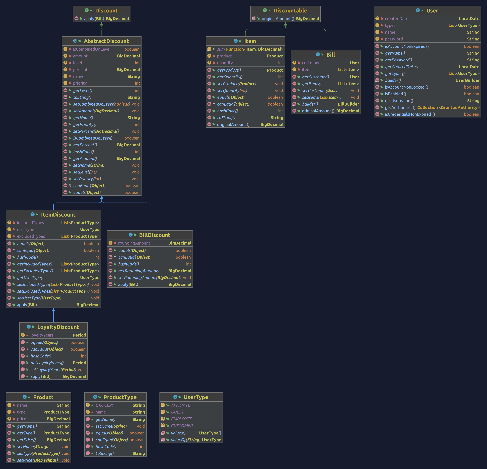
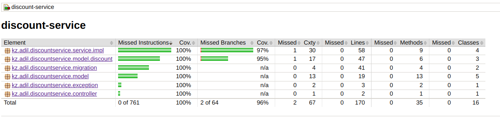

# Discount service

## Introduction

Application for calculating compound discounts
All users settings and discounts are stored in the mongo database with name "discount", which is started through the docker-compose file. All new entries are created automatically.
For unauthorized users, all operations are performed as a guest.

### Classes diagram


### Test coverage report



## Features

- Cross-platform: Windows, Mac, and Linux are officially supported.
- Java 8
- Spring Boot 2.7.0
- Apache Maven 3.8.1
- Docker 20.10.12

### How run application

- Cloning project
```shell
git clone https://https://github.com/adil-rakhimbekov/discount-service.git
```

  Requirements: Apache Maven 3.8.1, Java 1.8


- Run in command line

```shell
docker-compose -f ./docker/docker-compose.yml up -d
mvn spring-boot:run
docker-compose -f ./docker/docker-compose.yml down
```

Basic authorization is used.
Users are automatically created:
```shell
user1 / user1 #EMPLOYEE
user2 / user2 #AFFILATE
user3 / user3 #CUSTOMER
```
  
- Request example
```shell
curl --location --request POST 'localhost:8080/api/v1/calculate' \
  --header 'Authorization: Basic dXNlcjE6dXNlcjE=' \
  --header 'Content-Type: application/json' \
  --data-raw '{
  "items": [
  {
  "product":{
  "name": "bread",
  "type": "grocery",
  "price": "99.0"
  },
  "quantity": 1
  },
  {
  "product":{
  "name": "jeans",
  "type": "clothes",
  "price": "990.0"
  },
  "quantity": 1
  }
  ]
  }'
```
  
- Response example
```
  {
    "createdDatetime": "2022-06-02T08:24:26.831125+06:00",
    "discountAmount": "376.7",
    "totalAmount": "1089.0",
    "netAmount": "712.3"
  }
```

### How run tests and generate code coverage report

- For Linux/Bash

```shell
chmod +x ./script/run_test.sh
./run_test.sh
```

- For other OS

```cmd
docker-compose -f ./docker/docker-compose.yml up -d
mvn clean install jacoco:report
docker-compose -f ./docker/docker-compose.yml down
```

  The report can be found in ./target/site/index.html

## Creator

This project was created and is led by [Adil Rakhimbekov](https://github.com/adil-rakhimbekov).